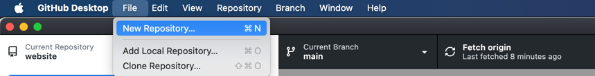
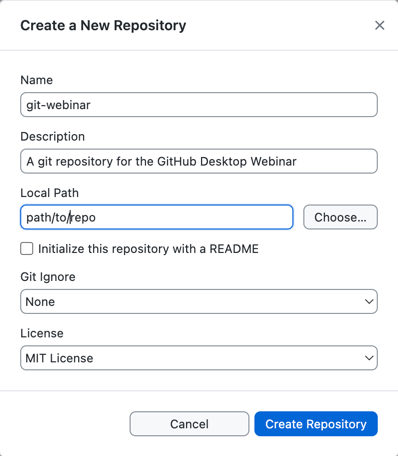
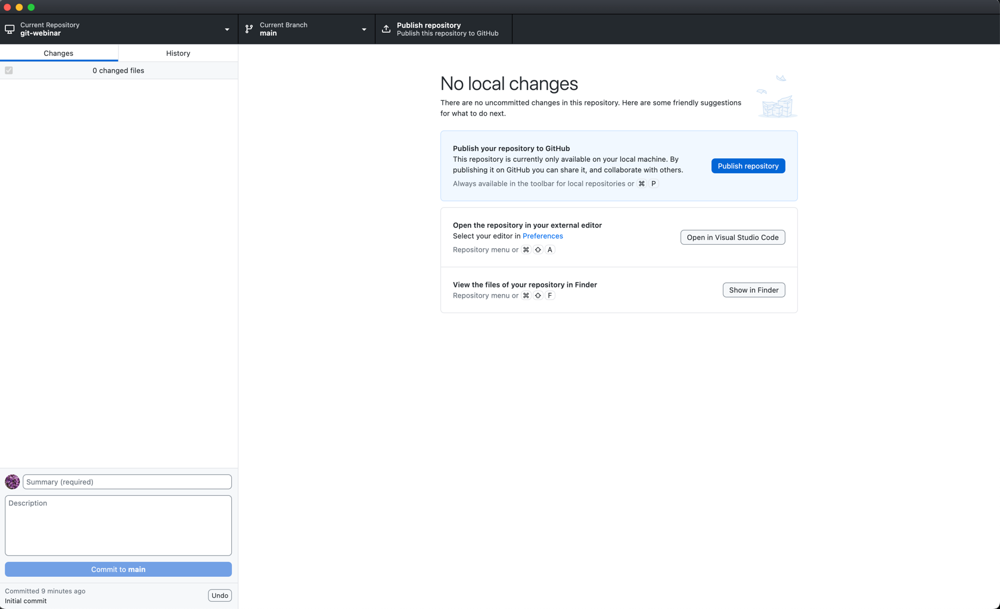
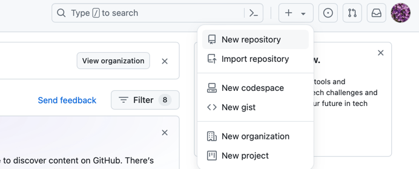
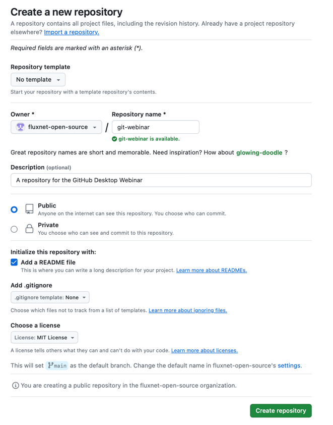
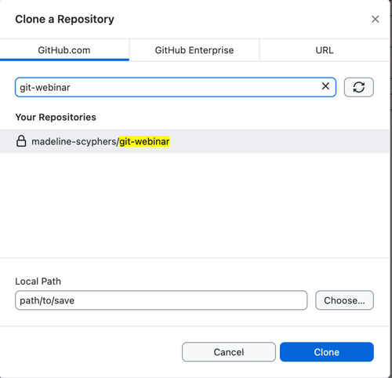

# 3: How to Create and Initialize a Git Repository Locally Using GitHub Desktop

A Git repository is a storage space where your project's files and their history are tracked using Git, a version control system. It allows developers to manage changes to a project's source code over time, enabling collaboration by keeping a detailed history of modifications, additions, and deletions. Each change is recorded in the repository with a unique identifier, making it possible to revert to previous versions if needed.

Generally you use a single repository for each project, but you can have multiple repositories for different parts of a project or related projects. And Git will be able to track the changes of all the files in that directory and its subdirectories that you tell Git to track.

## Table of Contents

1. [Create a New Repository](#create-a-new-repository)
1. [Fill in Repository Details](#fill-in-repository-details)
1. [Verify the Repository](#verify-the-repository)
1. [Alternative Method: Create a Repository Directly on GitHub and Clone it to GitHub Desktop](#alternative-method-create-a-repository-directly-on-github-and-clone-it-to-github-desktop)

## Create a New Repository

1. In GitHub Desktop, click on the `File` menu in the top left corner.
2. Select `New repository...` from the dropdown menu.

## Fill in Repository Details

1. **Name**: Enter a name for your repository, this tutorial will use `git-webinar`.
2. **Description**: Optionally, enter a description for your repository, for example, `"A repository for the GitHub Desktop Webinar"`.
3. **Local Path**: Choose a location on your computer where the repository will be created.
4. **Initialize this repository with a README**: Check this box to include a blank README file in the repository. If it is recommended to include a README file in a repository, as it provides information about the project and helps others understand its purpose, especially public repositories. But you can always add a README file later manually if you prefer.
  - Leave this box unchecked for this tutorial.
5. **Git Ignore**: Optionally, select a template for the `.gitignore` file to exclude certain files or directories from version control. Many programming languages will create certain files that you don't want to include in your version history, such as compiled binaries, temporary files, or virtual environments. Selecting a template will create a `.gitignore` file with common exclusions for that language.
6. **License**: Optionally, select a license for your repository. A license specifies how others can use, modify, and distribute your code. If you are unsure, you can choose to add a license later. You can also go to [choosealicense.com](https://choosealicense.com/) to learn more about different licenses and choose the one that best fits your needs.

Click the `Create repository` button. GitHub Desktop will create the repository in the specified location and initialize it with a README file (if selected).

## Verify the Repository

After creating the repository, you will be taken to the repository view in GitHub Desktop. You should see the current status of the repository, such as a list of what files have been changed (which should be empty if you did not add any files yet).

## Alternative Method: Create a Repository Directly on GitHub and Clone it to GitHub Desktop

If you prefer to create a repository directly on GitHub's website, you can follow these steps:

1. Go to your account on [GitHub](https://github.com)
2. Click on the `+` icon in the top right corner and select `New repository`.

3. Fill in the repository details (name, description, public/private, etc.). and click `Create repository`.

4. In GitHub Desktop, click on the `File` menu in the top left corner and click on `Clone repository...` or click the Add button and select `Clone repository...`.

5. Select the repository you just created on GitHub and choose a local path to clone the repository to your computer. Click `Clone`.

