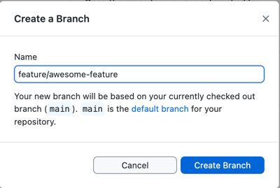
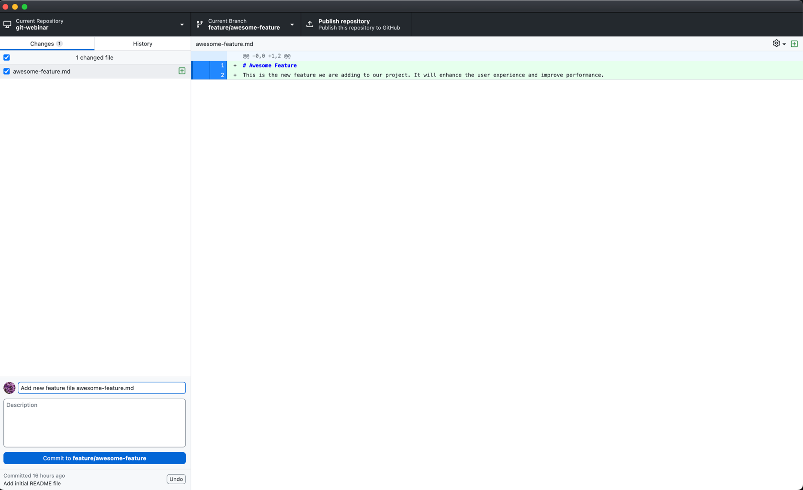
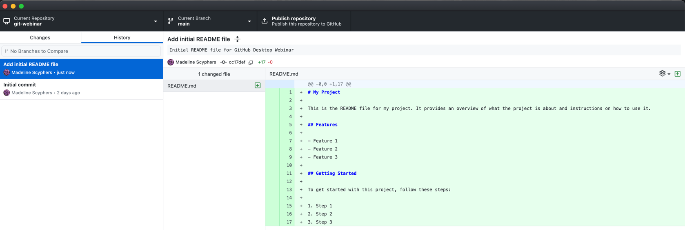

# 6: Creating a Branch

In this chapter, you'll learn how to create a new branch, make and commit changes in that branch, and then switch back to the main branch using GitHub Desktop.

Git allows you to work on multiple lines of development simultaneously by creating branches. This is useful when you want to work on a new feature, fix a bug, or experiment with changes without affecting the main codebase. Once you are satisfied with the changes in the branch, you can merge it back into the main branch.

Another useful feature of Git is that you can go back and forth between branches. This is called "branch switching" or "checking out" a branch. This allows you to work on different features or fixes independently and switch between them as needed.

## Table of Contents

1. [Creating a Branch](#creating-a-branch)
1. [Making and Committing Changes in the New Branch](#making-and-committing-changes-in-the-new-branch)
1. [Switching Back to the Main Branch](#checkout-the-main-branch)

## Creating a Branch

1. In GitHub Desktop, click on the `Current Branch` dropdown in the top toolbar.
1. Select `New Branch...` from the dropdown menu.


1. In the `Name` field, enter a name for your new branch (e.g., `awesome-feature` or `feature/awesome-feature`). some common branch naming conventions include:
    - `feature/branch-name`: for new features
    - `bugfix/branch-name`: for bug fixes
    - `hotfix/branch-name`: for critical fixes
    - `release/branch-name`: for release preparation
    - `docs/branch-name`: for documentation changes
1. Click the `Create Branch` button.



## Making and Committing Changes in the New Branch

1. With the new branch selected, click the `Repository` menu and select `Open in <Your Default Editor>` to open the repository in your text editor.
1. Make changes to your files or create new files as needed. For example, you could create a new file called `awesome-feature.md` and add some content to it.

### Example Content for awesome-feature.md:

```markdown
# Awesome Feature
This is the new feature we are adding to our project. It will enhance the user experience and improve performance.

```

1. Save your changes in the text editor.
1. Return to GitHub Desktop. You should see your changes listed under the `Changes` tab.
1. In the `Summary` field, write a brief description of the changes you made (e.g., "Add new feature file awesome-feature.md").
1. Optionally, add a more detailed description in the `Description` field.
1. Click the `Commit to <your-branch-name>` button to commit your changes.



## Checkout the Main Branch

With Git you can switch back to the main branch easily (or another branch). You can do that anytime your code is committed and stable. You can also do this if you have uncommitted code, but that code will be lost if you switch branches without committing it, or use a more advanced Git feature like stashing.

1. Click on the `Current Branch` dropdown in the top toolbar.
2. Select `main` (or `master`, depending on your default branch name) from the dropdown menu to switch back to the main branch.


3. Verify that you are now on the main branch and your previous changes are not present in this branch, and if you look in your text editor, you should see the changes you made in the new branch are no longer visible (such as the `awesome-feature.md` file not being present).

                                
