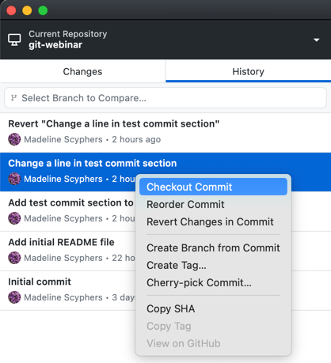
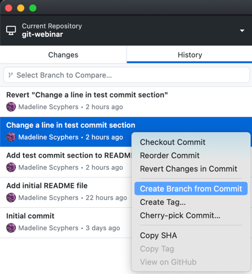

# 7: Revisiting Old Commits in GitHub Desktop

In this chapter, you'll learn how to revisit old commits in GitHub Desktop. We'll guide you through checking out an old commit to view it, explain what a detached HEAD is and its dangers, and show you how to create a branch from an old commit if you want to continue from that point.

## Table of Contents

1. [Checking Out an Old Commit](#checking-out-an-old-commit)
2. [Understanding Detached HEAD](#understanding-detached-head)
3. [Creating a Branch from an Old Commit](#creating-a-branch-from-an-old-commit)

## Checking Out an Old Commit

1. In GitHub Desktop, click on the `History` tab to view the list of commits.
2. Right-click on a commit you want to checkout and go back to and select `Checkout <commit-hash>`.

3. GitHub Desktop will switch to the selected commit, allowing you to view the state of the repository at that point in time.

## Understanding Detached HEAD

- When you check out an old commit, Git places you in a "detached HEAD" state. This means that your `HEAD` (a pointer that references the current location) is not pointing to the end of a branch but to a specific commit.
- In a detached HEAD state, any changes you make will not be associated with any branch. This can lead to losing your work if you switch branches or commits without creating a new branch from the detached state.

### What is a HEAD in Git?

  
Optional Section

  
## Definition of HEAD in Git

In Git, **HEAD** is a pointer that references the current commit that your working directory is based on. It essentially represents the snapshot of your project that you are currently working on. 

### Key Points:

- **Current Branch**: When you are on a branch, HEAD points to the latest commit in that branch.
- **Detached HEAD**: When you check out a specific commit (not a branch), HEAD points directly to that commit. This state is known as a "detached HEAD."

### Functionality:

- **Switching Branches**: When you switch branches, HEAD moves to point to the latest commit on the new branch.
- **Committing Changes**: When you make a commit, HEAD updates to point to the new commit.

### Example:

If you are working on the `main` branch, HEAD will point to the most recent commit in the `main` branch. If you switch to another branch called `feature-branch`, HEAD will then point to the latest commit in the `feature-branch`.

In summary, HEAD is an important concept in Git that helps you understand your current working state and navigate between different commits and branches in your repository.

### Dangers of Detached HEAD

- **Loss of Changes**: Changes made in a detached HEAD state can be lost if you move away from the commit without saving them in a new branch.
- **No Branch Association**: Your changes are not tracked under any branch, making it hard to manage and collaborate.

### Why Checking Out an Old Commit is for Viewing, Not Changing

- Checking out an old commit is primarily for viewing the state of your project at that point in time. It allows you to see the code and files as they were during that commit.
- Making changes in a detached HEAD state is risky because those changes are not tracked by a branch, making it easy to lose your work.

## Creating a Branch from an Old Commit

If you want to make changes starting from an old commit, you should create a new branch from that commit.

1. Right click on the commit you want to create a branch from in the `History` tab, and select `Create Branch from Commit` from the dropdown menu.

2. GitHub Desktop will create a new branch from the checked-out commit and switch to that branch. Now, any changes you make will be tracked under this new branch.

By following these steps, you can safely revisit and manage old commits in GitHub Desktop. This includes checking out old commits to view their state, understanding the implications of a detached HEAD, and creating new branches from old commits to continue development from a specific point in the project’s history.
