# Pull Requests (PRs) in GitHub

In this chapter, you'll learn how to publish a branch, open a Pull Request (PR) on GitHub, navigate the PR interface, and merge code. You'll also learn about what happens when there is a conflict during the merge process and how to resolve it. 

## Table of Contents

1. [What is merging?](#what-is-merging)
2. [Opening a Pull Request](#opening-a-pull-request)
3. [Navigating the PR Interface](#navigating-the-pr-interface)
4. [Merging a PR](#merging-a-pr)
5. [Fetching Changes](#fetching-changes)

## What is merging?

A merge in Git is the process of combining changes from one branch into another. This allows developers to integrate features, bug fixes, or updates made in separate branches into another branch (in this chapter, the `main` branch. Git attempts to automatically reconcile changes, but if there are conflicting modifications to the same lines of code, manual resolution is required. The result of a successful merge is a unified history that includes changes from both branches.

This is often done through what is called Pull Requests (PRs) in GitHub. It is called that because you are requesting to pull in changes from one branch to another.

We will be publishing our branch from earlier in the tutorial, `feature/awesome-feature`, and creating a PR to merge it into the `main` branch. Any and all commits from `feature/awesome` will  end up in the `main` branch.

### switch to feature/awesome-feature

In GitHub Desktop, click on the `Current Branch` dropdown in the top toolbar and select `feature/awesome-feature`, then click on the `Publish branch` button.

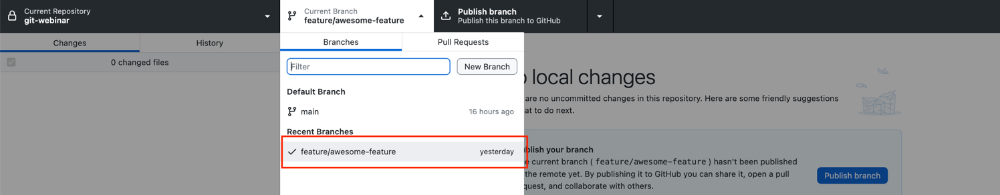

## Opening a Pull Request

1. Go to your repository on GitHub.

or on github.com, navigate to your profile icon and click on your repositories and find the git-webinar repository.

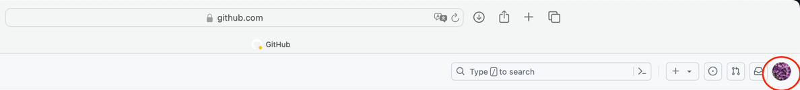

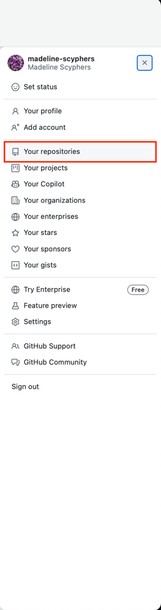

2. Click on the `Pull requests` tab.
3. Click the `New pull request` button.

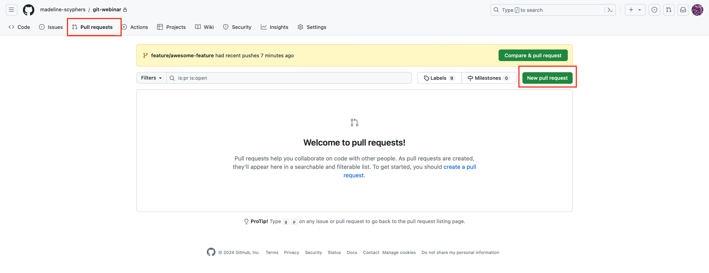

4. Select the `base` branch (e.g., `main`) and the `compare` branch (e.g., `feature/awesome-feature`).

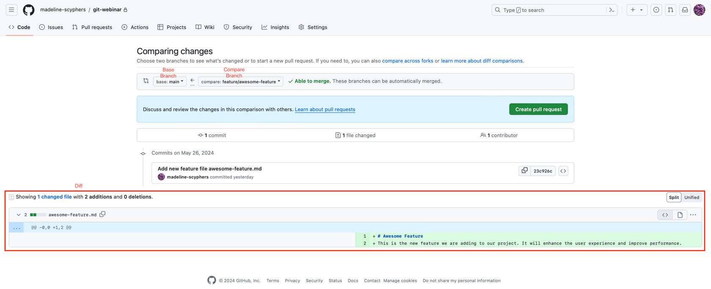

5. Click the `Create pull request` button.
6. Fill in the title and description for your PR, then click `Create pull request`.

If you just pushed to a branch, often GitHub will have a button to create a PR right after you push, that fills in a lot of the details for you to streamline the process.

  
Description Tip

If you copy and paste the commit message (including the expanded description by clicking on the commit message), it will automatically link to the commit, making it easier for reviewers to see the changes.

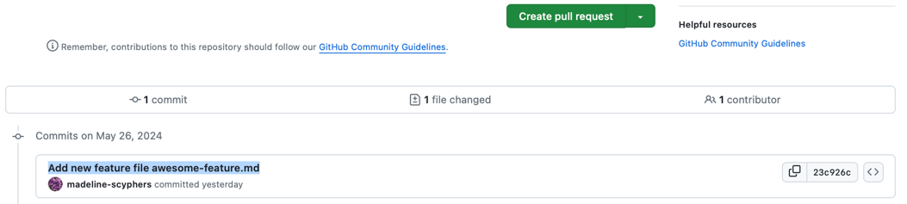

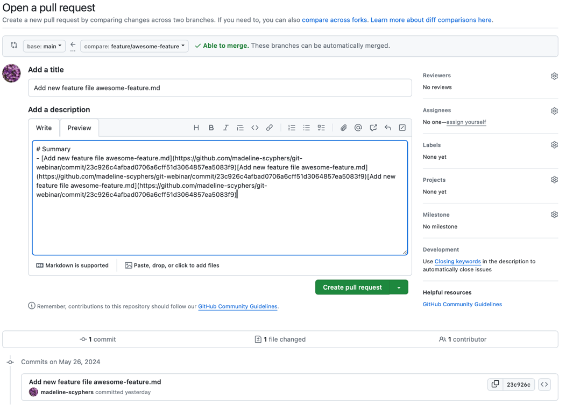

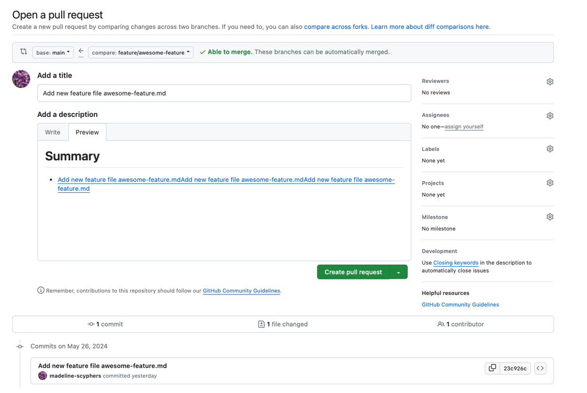

## Navigating the PR Interface

1. **Conversation Tab**: This is where you can see the discussion about the PR, add comments, and review feedback from collaborators.
  - On the right side you can also request reviews from specific people or teams, add labels to categorize the PR (e.g., documentation, bug fix, enhancement), or other actions.
2. **Commits Tab**: Shows a list of all commits included in the PR.
3. **Checks Tab**: Displays the status of automated checks, such as continuous integration (CI) tests, documentation building, and code quality checks.
3. **Files Changed Tab**: Displays the differences between the base and compare branches, highlighting the changes made in the PR.

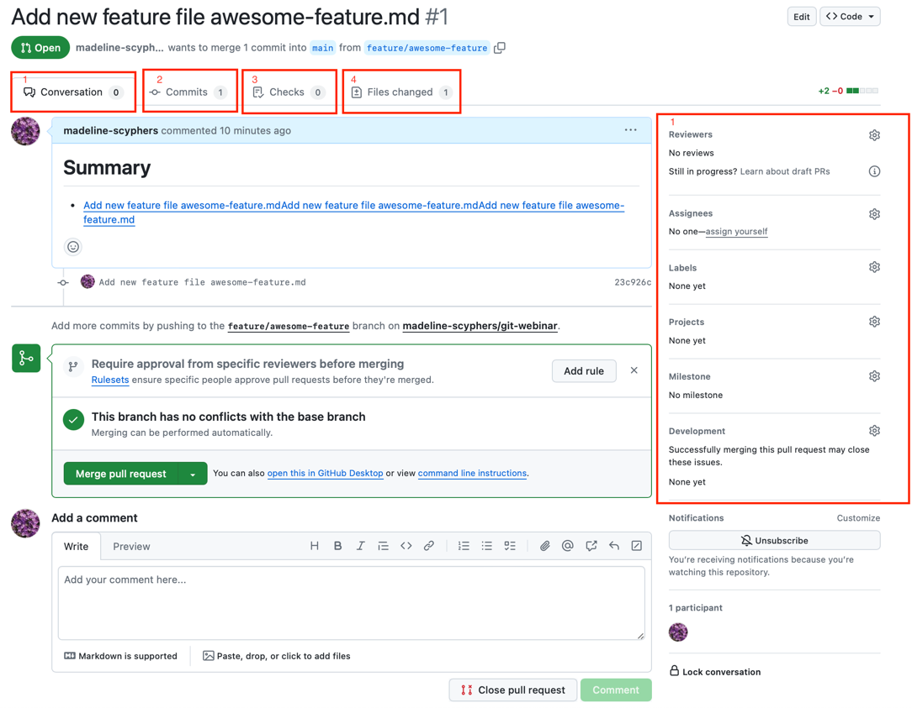

## Merging a PR

1. When ready, click the `Merge pull request` button.
  - Ready might mean that in a collaborative environment, you have received approval from other team members. You also might have automated checks that need to pass before merging like tests or documentation building.
2. Confirm the merge by clicking the `Confirm merge` button.

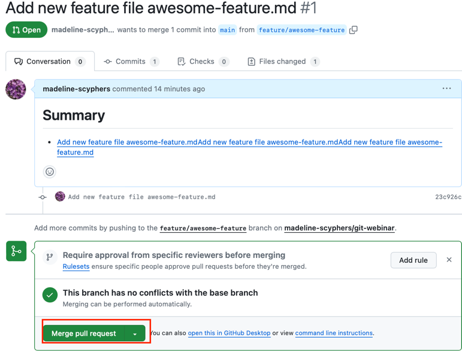

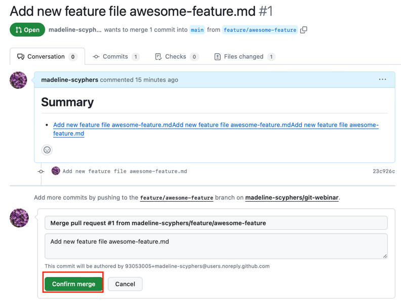

3. Optionally, delete the branch by clicking the `Delete branch` button to keep the repository clean. Generally you want to delete branches that have been merged to keep the repository clean and easy to navigate. The exception is if you are working on a long-running permanent branch like `main` or `develop`.

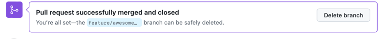

## Fetching Changes

We just made changes to our repository on GitHub, but our local repository is not aware of these changes. To update our local repository with the changes from the remote repository, we need to do what is called a `fetch`. This will let your repository know the changes from the remote repository. Since we merged `feature/awesome-feature` into `main`, we need to fetch the changes to the `main` branch, as that is the branch with the new commits. Then we will have to pull those changes into our local repository.

1. In GitHub Desktop, we need to be on the main branch. If you are not on the main branch, click on the `Current Branch` dropdown in the top toolbar and select `main`.

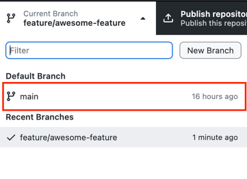

2. Click on the `Repository` menu and select `Fetch origin`.

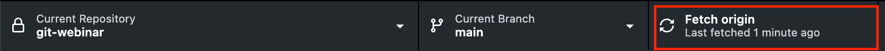

3. Finally, click on the `Pull origin` button to pull the changes from the remote repository to your local repository.

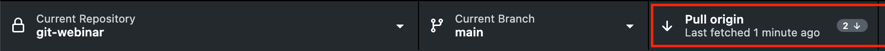

  
fetch and pull note with Git clients

Some Git clients like GitHub Desktop will automatically fetch changes from the remote repository when you open the application or switch branches. However, it's a good practice to manually fetch changes to ensure your local repository is up-to-date with the remote repository.

Some other Git clients combine the fetch and pull steps into a single operation, so you might see a "Fetch and Pull" or "Sync" button instead of separate fetch and pull buttons.

