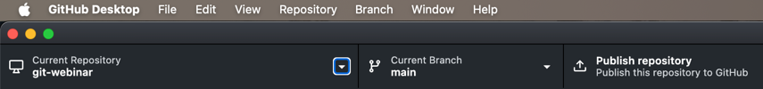
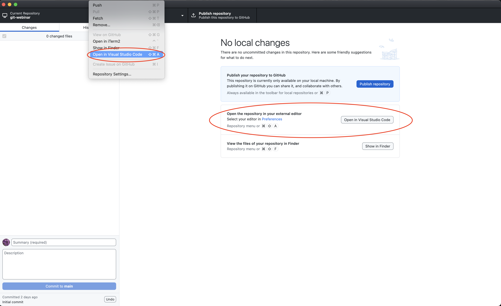
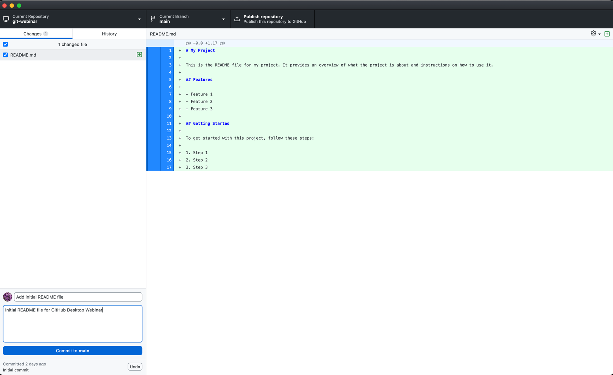

# Chapter: Making and Committing Changes in Your GitHub Desktop Repository

In this chapter, we'll guide you through making changes to your newly created repository using GitHub Desktop. You will learn how to open your default editor, create or edit files, and commit those changes to your repository.

## Table of Contents

1. [Step 1: Open Your Repository in GitHub Desktop](#open-your-repository-in-github-desktop)
2. [Step 2: Open the Repository in Your Default Editor](#step-2-open-the-repository-in-your-default-editor)
3. [Step 3: Create or Edit a README File](#step-3-create-or-edit-a-readme-file)
4. [Step 4: Save Your Changes](#step-4-save-your-changes)
5. [Step 5: Commit Your Changes](#step-5-commit-your-changes)
6. [Step 6: Verify Your Commit](#step-6-verify-your-commit)

## Open Your Repository in GitHub Desktop

Launch GitHub Desktop and select your repository from the list on the left side under current repository.



## Step 2: Open the Repository in Your Default Editor

1. In GitHub Desktop, click on the `Repository` menu.
2. Select `Open in <Your Default Editor>` from the dropdown menu. This will open your repository in the default text editor set for your system (e.g., Visual Studio Code, Sublime Text, Atom).



## Step 3: Create or Edit a README File

1. If you initialized the repository with a README file, open the `README.md` file in your editor.
2. If there is no README file, create a new file named `README.md`.

### Example Content for README.md:

```markdown
# My Project

This is the README file for my project. It provides an overview of what the project is about and instructions on how to use it.

## Features

- Feature 1
- Feature 2
- Feature 3

## Getting Started

To get started with this project, follow these steps:

1. Step 1
2. Step 2
3. Step 3

```

## Step 4: Save Your Changes

After editing or creating the `README.md` file, save the changes in your text editor.

## Step 5: Commit Your Changes

1. Return to GitHub Desktop. You should see that your changes are detected under the `Changes` tab.
2. In the `Summary` field, write a brief description of the changes you made (e.g., "Add initial README file").
  - The summary should be concise and describe the main purpose of the changes. Convention is to keep it under 50 characters and use the imperative mood (e.g., "Add feature" instead of "Added feature"). You should try and keep it under 72 characters to ensure it is displayed correctly in some tools. But don't worry too much about this, as tools are more flexible than they used to be. 
3. Optionally, add a more detailed description in the `Description` field.
4. Click the `Commit to main` button to commit your changes.



## Step 6: Verify Your Commit

1. Click on the `History` tab to see a list of all commits made to the repository.
2. Verify that your recent commit appears in the history with the correct summary and description.


