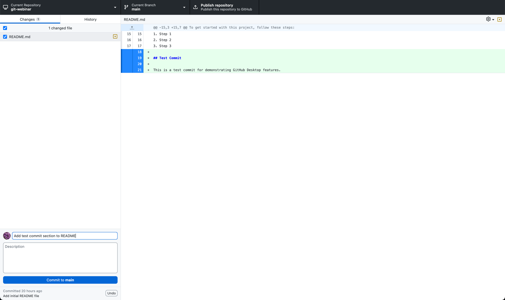
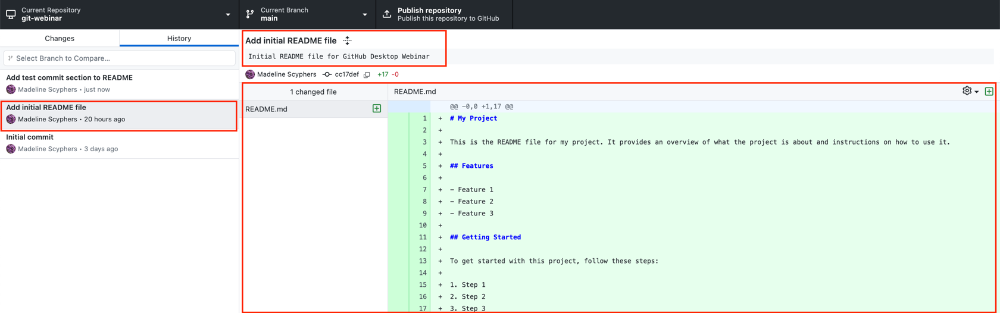
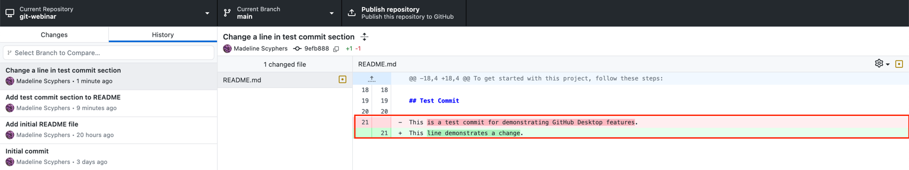
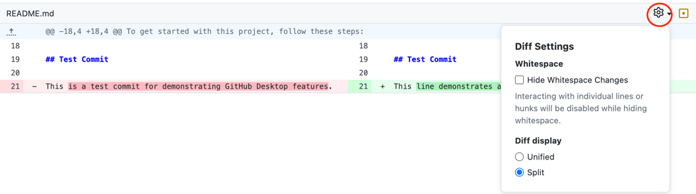
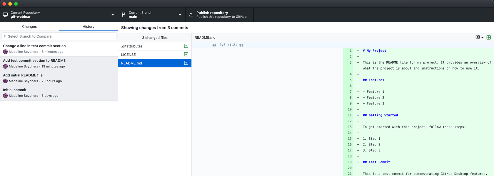
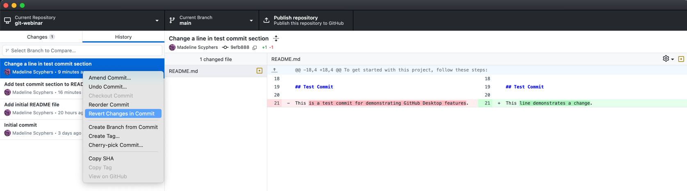
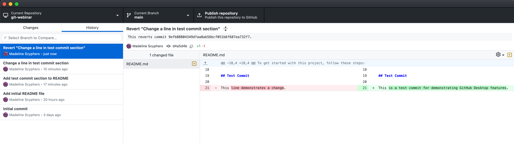

# Chapter: Viewing and Managing History with GitHub Desktop

In this chapter, you'll learn how to manage the commit history using GitHub Desktop. We'll guide you through making a test commit, viewing individual previous commits, checking the differences (diff) across several commits, and reverting a commit. We'll also discuss the difference between reverting and undoing commits.

## Table of Contents

1. [Making a Test Commit](#making-a-test-commit)
2. [Viewing Commit History](#viewing-commit-history)
3. [Viewing Differences Across Commits](#viewing-differences-across-commits)
4. [Reverting a Commit](#reverting-a-commit)
5. [Reverting vs. Undoing Commits](#reverting-vs-undoing-commits)

## Making a Test Commit

1. In your default text editor, make a simple change to a file, such as adding a line to the `README.md` file.

### Example Change to README.md:

```markdown
## Test Commit

This is a test commit for demonstrating GitHub Desktop features.

``` 

2. Save your changes and return to GitHub Desktop. You should see your changes listed under the `Changes` tab.
3. In the `Summary` field, write "Add test commit section to README".
4. Click the `Commit to main` button to commit your changes.



## Viewing Commit History

1. Click on the `History` tab to view the list of commits made to the repository.
2. Select any commit to view its details, including the changes made and the commit message.



### Change README.md again

1. This time, remove the line `This is a test commit for demonstrating GitHub Desktop features.`, but not the heading. Replace it with anything you want, such as `This line demonstrates a change.`. 
2. Save your changes and return to GitHub Desktop. You should see your changes listed under the `Changes` tab.
3. In the `Summary` field, write "Change a line in test commit section".
4. Click the `Commit to main` button to commit your changes.

## Viewing Commit History

1. Click on the `History` tab to view the list of commits made to the repository.
2. Select the most recent commit to view its details. You will see that the diff includes what was removed and added.  



3. You can change the diff from displaying in-line to side-by-side by clicking the settings cog.



## Viewing Differences Across Commits

1. In the `History` tab, highlight multiple commits with shift will allow you to compare the differences between several commits
2. Click on any file listed in the commit to see a side-by-side comparison of the changes made (diff view).



## Reverting a Commit

1. In the `History` tab, right-click on the commit you want to revert and select `Revert This Commit`.



2. GitHub Desktop will create a new commit that undoes the changes made by the selected commit.
3. You can view this new commit in the `History` tab to verify that the changes were reverted.



## Reverting vs. Undoing Commits

- **Reverting a Commit**: This creates a new commit that undoes the changes made by a previous commit. Reverting is safe to do even if the commit has been pushed to a remote repository because it maintains the commit history.
- **Undoing a Commit**: This involves removing the commit from the history, effectively rewriting the commit history. Undoing commits is typically done with the CLI command `git reset` or `git revert --hard`, and it can cause issues if the commit has already been pushed to a remote repository because it changes the commit history that others may have based their work on.

### Why You Can't Undo a Commit Generally If It Is on a Remote

- Once a commit is pushed to a remote repository, other collaborators may have based their work on that commit. Undoing the commit (i.e., removing it from the history) can create inconsistencies and conflicts in the repository, making it difficult for others to synchronize their work.
- Reverting the commit, on the other hand, preserves the commit history by creating a new commit that undoes the changes, which is a safer and more collaborative-friendly approach.
